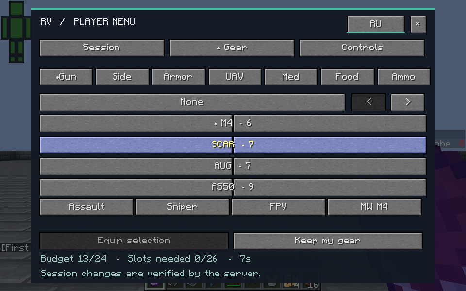
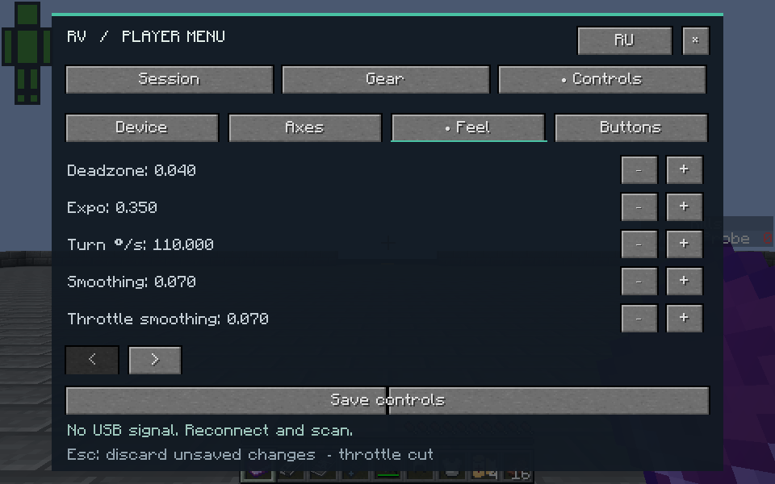
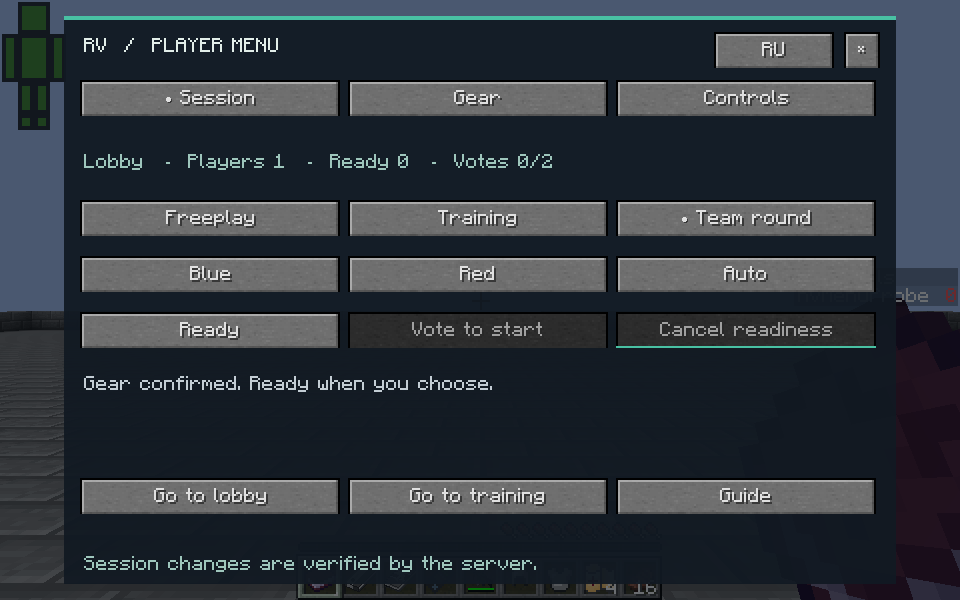

<p align="center"></p>

<p align="center">
  <a href="https://github.com/rudyvale/rv-warfare/releases/latest"></a>
  <a href="https://github.com/rudyvale/rv-warfare/actions/workflows/ci.yml"></a>
  
  
  
</p>

<p align="center"><strong>FPV drones, combat and a simpler way to play together.</strong><br>A Windows launcher and installer for a Minecraft 1.12.2 modpack.</p>

<p align="center">
  <a href="https://github.com/rudyvale/rv-warfare/releases/latest/download/RV-Setup.zip"><strong>Download RV</strong></a> ·
  <a href="pack/READ-ME.md">Player guide</a> ·
  <a href="https://github.com/rudyvale/rv-warfare/releases">Releases</a> ·
  <a href="https://github.com/rudyvale/rv-warfare/issues">Report a bug</a>
</p>

## Start playing

1. Download **RV-Setup.zip** from the [latest release](https://github.com/rudyvale/rv-warfare/releases/latest) and extract the entire archive.
2. Open **INSTALL.cmd**, enter a nickname and click **Install**.
3. Click **Play**. The first-play setup lets you choose mouse and keyboard, an FPV radio or a gamepad, then your server.
4. Join once the host's server is running. Device setup and connection details remain available in **Settings**.

Porthole connections require Steam. If Porthole is missing, RV opens its installation in Steam and waits for it to finish. Direct connections do not require Steam. Public downloads contain no personal server destination.

<p align="center"></p>

## What is included

| Feature | What it does |
| :--- | :--- |
| **Installation** | Sets up Java 8, Forge, libraries and the modpack; reuses verified local files |
| **FPV flight** | Easy mouse-and-keyboard flight, Angle and Acro modes, axis mapping and calibration |
| **Aircraft** | A quadcopter, combat FPV, Geran and FP-1 with distinct models and flight behaviour |
| **Combat** | Techguns and MC Heli CE, tank controls, server-confirmed damage feedback and combat audio |
| **Medical care** | First Aid wounds and timed healing, with configurable visual effects |
| **World and guide** | A separate 2560 × 2560 battlefield with destructible props, roads and buildings; a 28-page guide in stable RV 1.2.1 and a 30-page guide in RV 2 Preview, in each language |
| **First-play setup** | Actual device selection, calibration and server selection; cancelled setup preserves saved choices |
| **Graphics profiles** | Low, Balanced and Quality applied explicitly; language changes preserve graphics settings |
| **Connections** | Porthole code, Steam peer or lobby; direct IP or hostname and port |
| **Quiet updates** | Checks GitHub in the background when opening, launching or installing |
| **Your data** | Preserves worlds, nickname, language, connection details and user files; backs up replaced files |
| **Interface** | English and Russian, Windows display scaling, a simple code icon |

RV 1.2 adds AmbientSounds, Mouse Tweaks, Biomes O' Plenty, Immersive Vehicles with IAV and VEB, ModularWarfare and MCglTF. The installer downloads the eight exact vendor files from their official sources and verifies SHA-256 before changing the installation. Those files are not rehosted in this repository or its releases. See the [compatibility notes](docs/COMPATIBILITY.md) for versions, dependencies and download rights.

The standard equipment menus retain the tested MC Heli, Techguns and FPV sets. New vehicle and ModularWarfare combat remains advanced content: cross-mod damage, cannon firing and physical audio direction are not fully verified.

## RV 2 Preview

RV 2 introduces a player menu for **Session**, **Gear** and **Controls**, with equipment previews, explicit confirmation, readiness and server validation. The installer configures missing keyboard controls automatically and can import a host's local invitation. Use matching RV 2 client and server versions. Stable RV 1.2.1 remains the automatic update target.



<details>
<summary>Flight-feel controls and session readiness</summary>





</details>

These are original captures from the final preview module, tested with one isolated ordinary player and a dedicated Forge server. Equipment confirmation, readiness cancellation, both guide languages and travel destinations passed native checks. Two-player sessions, physical controllers, full-inventory rollback and new vendor combat remain outside that acceptance. See [capture provenance](docs/gallery/README.md), the [preview changes](https://github.com/rudyvale/rv-warfare/pull/1) and [release contract](docs/RELEASE-CONTRACT.md).

## In game

These are unedited screenshots from the game. The aircraft views use optional BSL shaders; they do not represent the default graphics settings or an FPS guarantee.

<p align="center"></p>

| Geran | FP-1 |
| :---: | :---: |
|  |  |

<details>
<summary>Compare the same scene with shaders off and with BSL</summary>

| Shaders off | Optional BSL shaders |
| :---: | :---: |
|  |  |
|  |  |

</details>

See the [player guide](pack/READ-ME.md) for flight, tank controls, healing and graphics settings, and [screenshot provenance](assets/gameplay/README.md) for capture details.

## Updates that stay out of the way

The update check runs in a hidden process. It opens no browser or console and does not hold up the interface while waiting for GitHub. Network failures leave the installed game available. Automatic checks can be disabled in **Settings**, and that choice survives reinstalls and updates.

When a newer stable version is available, click **Update**. RV checks the download's size, SHA-256, archive paths and version before installation. Close the game before replacing its files. [How updates work →](docs/UPDATES.md)

## Host a session

The host panel has separate **Play**, **Start server** and **Stop server** actions. Closing the panel leaves the server running. Settings include language, server memory, controller configuration and automatic update checks.

<p align="center"></p>

**RV-Host-Tools.zip** contains the panel and management scripts for an existing configured server. The optional **RV-World-Template.zip** is a separate clean world for a new server. Existing worlds are never replaced by background updates. **RV-Third-Party-Sources.zip** contains the original pinned source archives and notices for the three medical and visual-effects dependencies. [Host setup and requirements →](host/README.md)

## Requirements

- Windows 10 / 11, 64-bit, with Windows PowerShell 5.1.
- Internet access for initial installation and update downloads.
- Steam and Porthole when using Steam-based connections.
- Enough memory and disk space for modded Minecraft; requirements depend on world size, settings and extra mods.

Java is bundled with the installer. Python is needed for development and the separate host panel; the client installer does not require it.

## Repository

```text
src/          Client launcher, installer and update checker
host/         Host panel and server management scripts
pack/         Manifests, configuration and player guide
patches/      Mod changes and supporting build tools
assets/       Code icon, banner and screenshots
tools/        Packaging, publishing and verification
qa/           Installation, interface and update checks
docs/         Development and release documentation
```

Downloadable binaries live in **Releases**. Player worlds, account profiles, personal connection settings and logs are excluded from Git.

See [development instructions](docs/DEVELOPMENT.md), [contribution guidelines](CONTRIBUTING.md), [changes](CHANGELOG.md) and [verification scope](QA.md). Minecraft and the bundled components belong to their respective authors; see [credits and notices](THIRD_PARTY.md).

<p align="center"><sub>RV Warfare · Minecraft 1.12.2 · Built for playing together</sub></p>
