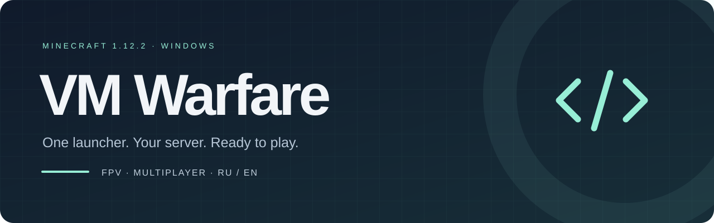
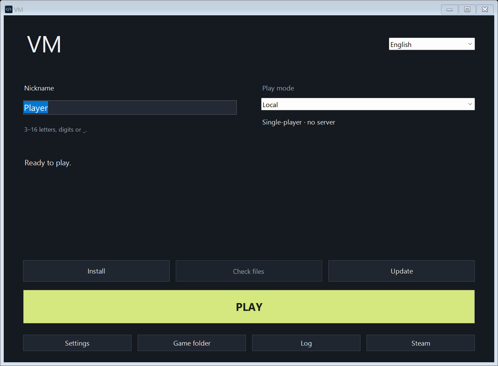
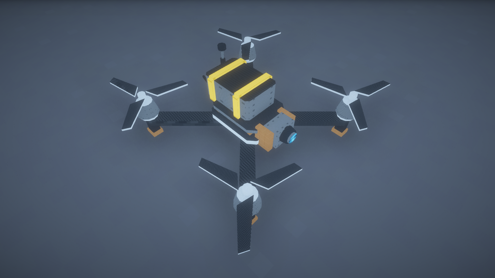
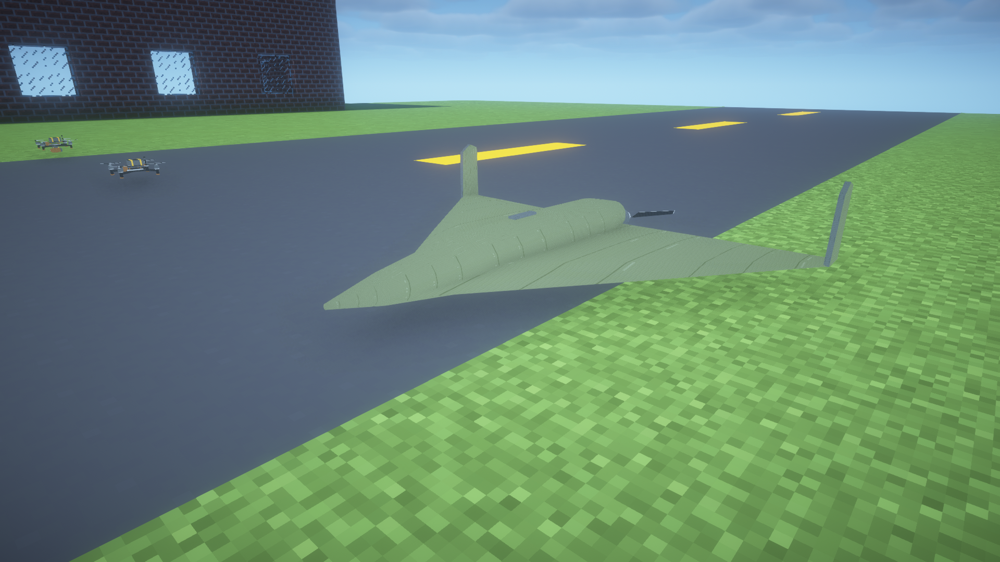
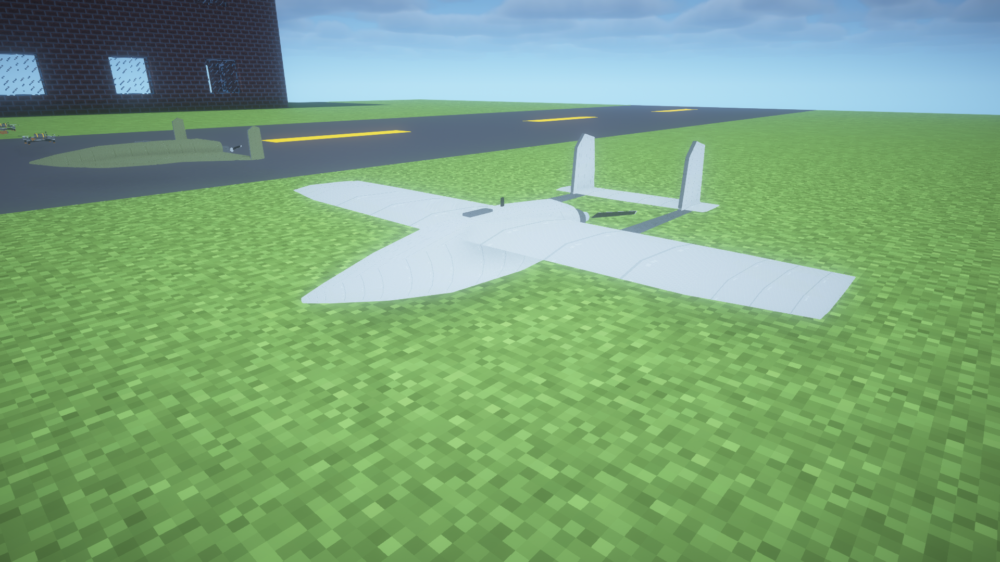
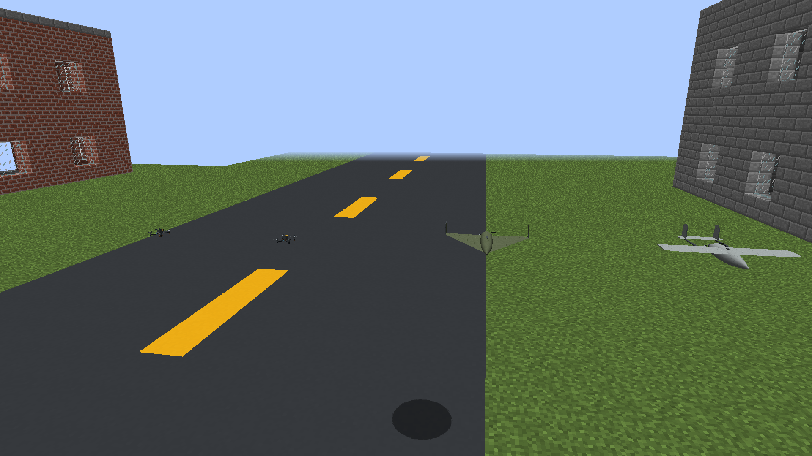
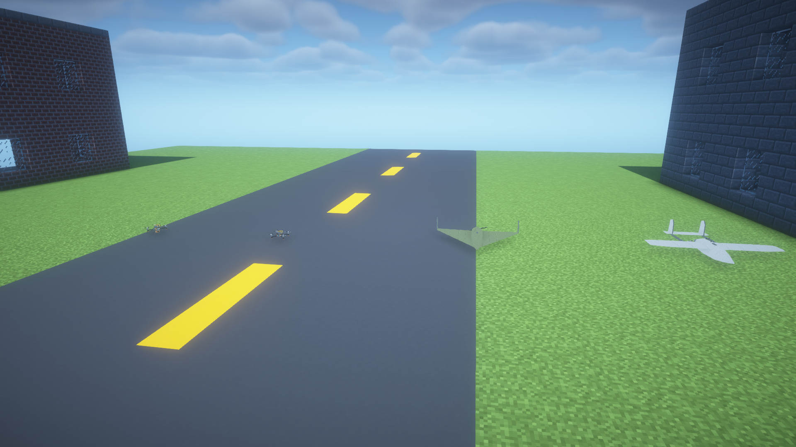
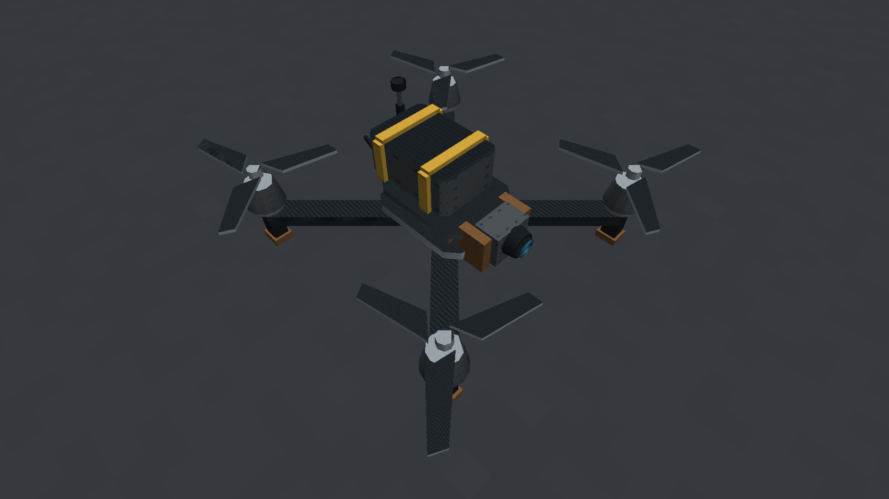
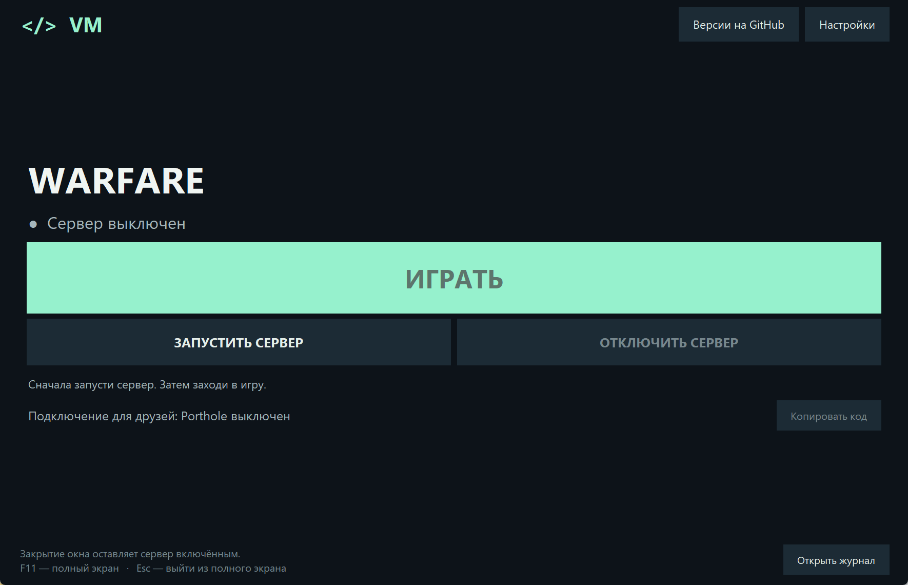

<p align="center"></p>

<p align="center">
  <a href="https://github.com/rudyvale/rv-warfare/releases/latest"></a>
  <a href="https://github.com/rudyvale/rv-warfare/actions/workflows/ci.yml"></a>
  
  
  
</p>

<p align="center"><strong>Aircraft, combat and a simpler way to play together.</strong><br>A Windows launcher and an experimental Intel Mac client for a Minecraft 1.12.2 modpack.</p>

<p align="center">
  <a href="https://github.com/rudyvale/rv-warfare/releases/latest/download/RV-Setup.zip"><strong>Download stable for Windows</strong></a> ·
  <a href="https://github.com/rudyvale/rv-warfare/releases/download/v2.0.4/RV-Setup.zip"><strong>Windows 2.0.4 Preview</strong></a> ·
  <a href="https://github.com/rudyvale/rv-warfare/releases/download/v2.0.4/RV-Mac-Setup.zip"><strong>Mac 2.0.4 Preview</strong></a> ·
  <a href="https://github.com/rudyvale/rv-warfare/blob/v2.0.4/pack/READ-ME.md">Player guide</a> ·
  <a href="https://github.com/rudyvale/rv-warfare/releases">All releases</a> ·
  <a href="https://github.com/rudyvale/rv-warfare/issues">Report an issue</a>
</p>

## Choose how to play

| Mode | Use it to |
| :--- | :--- |
| **Local** | Open a local world without choosing a server or using Steam or Porthole. |
| **Friends** | Join a friend's server using its saved connection. |
| **Owner** | Join the owner's server using a separately saved address. |
| **Host my server** | Start a separate Forge server, join it locally and share its connection with friends. Your world is kept between sessions. |

Friends and Owner keep separate connection details. Porthole connections require Steam; a direct address does not. Public downloads contain no personal server destination.

On Windows, **Host my server** currently provides LAN/direct addresses; automatic Porthole sharing is not included.

<p align="center"></p>
<p align="center"><sub>RV 2.0.4 Windows launcher in Local mode, captured from the native interface.</sub></p>

## Get RV

The **stable Windows download** and automatic update checks use the latest stable release, currently **RV 1.2.1**. Preview releases do not replace it.

**RV 2.0.4 Preview** adds an experimental macOS client alongside the Windows package. These links point to the Preview release assets:

- [Windows — RV-Setup.zip](https://github.com/rudyvale/rv-warfare/releases/download/v2.0.4/RV-Setup.zip)
- [Intel Mac — RV-Mac-Setup.zip](https://github.com/rudyvale/rv-warfare/releases/download/v2.0.4/RV-Mac-Setup.zip)
- [Preview notes](https://github.com/rudyvale/rv-warfare/blob/v2.0.4/docs/releases/2.0.4-preview.md)

The Mac package targets **Intel x64** and includes Java 8. Apple Silicon Macs need Rosetta 2. On Apple Silicon, Porthole is supported only with the official Steam installation. The Mac package is experimental: native macOS GUI and Minecraft runtime acceptance is still pending.

The Intel Mac launcher passed Java 8 compilation and bundled-runtime headless startup in [GitHub Actions](https://github.com/rudyvale/rv-warfare/actions/runs/37235905099/job/111534823887); native macOS GUI and in-game acceptance remain unverified.

### Install on Windows

1. Download and extract the complete **RV-Setup.zip** archive.
2. Open **INSTALL.cmd**, enter a nickname and select **Install**.
3. Select **Play**. Choose a controller and connection, or change them later in **Settings**.

Java is included. The installer verifies downloaded files before use and reuses valid local files.

## Game screenshots

These are genuine, unedited captures from the RV 1.1.0 scene. The aircraft and battlefield gameplay shown remain in RV 2.0.3 and the 2.0.4 Preview; the images illustrate that unchanged content and do not demonstrate macOS support or measured performance. Capture details and hashes are in the [screenshot provenance](assets/gameplay/README.md).

<p align="center"></p>

| Geran | FP-1 |
| :---: | :---: |
|  |  |

<details>
<summary>Compare the battlefield and quadcopter with shaders off and with BSL</summary>

| Shaders off | Optional BSL shaders |
| :---: | :---: |
|  |  |
|  |  |

</details>

The separate [RV 2.0.3 Preview menu captures](https://github.com/rudyvale/rv-warfare/blob/v2.0.3/docs/gallery/README.md) show tested player-menu flows; they are not Mac screenshots.

## What is in the modpack

- FPV flight with keyboard, gamepad or radio controls, plus Geran and FP-1 aircraft.
- Techguns and MC Heli CE combat, tanks, medical care and combat audio.
- A separate 2560 × 2560 battlefield with destructible props, roads and buildings.
- English and Russian interface and player guides.
- Low, Balanced and Quality graphics profiles.
- The RV 2 player menu for sessions, equipment and controls.

The standard equipment menus retain the tested MC Heli, Techguns and FPV sets. New vehicle and ModularWarfare combat remains advanced content; cross-mod damage, cannon firing and physical audio direction are not fully verified.

RV 1.2 includes AmbientSounds, Mouse Tweaks, Biomes O' Plenty, Immersive Vehicles with IAV and VEB, ModularWarfare and MCglTF. The installer downloads the pinned vendor files from their official sources and checks their SHA-256 hashes. They are not rehosted in this repository or its releases. See [compatibility and distribution rights](docs/COMPATIBILITY.md).

## Quiet updates

RV checks GitHub in the background when opening, launching or installing. The check opens no browser or console and does not hold up the interface. If GitHub is unavailable, the installed game remains usable. Automatic checks can be disabled in **Settings**, and that preference survives reinstalls and updates.

When a newer stable version is available, select **Update**. RV checks the download size, SHA-256, archive paths and version before installation. Close the game before replacing its files. [How updates work](docs/UPDATES.md).

## Host tools

**RV-Host-Tools.zip** contains the host panel and management scripts for a configured server. The panel keeps **Play**, **Start server** and **Stop server** as separate actions. The optional **RV-World-Template.zip** is a clean world for a new server; background updates never replace an existing world. [Host setup and requirements](host/README.md).

<p align="center"></p>

## Requirements

- Windows 10 or 11, 64-bit, with Windows PowerShell 5.1.
- For the experimental Mac Preview: Intel x64 Mac; Java 8 is bundled. Apple Silicon requires Rosetta 2.
- Internet access for initial installation and downloads.
- Steam and Porthole for Steam-based connections.
- Memory and disk space for modded Minecraft; needs depend on world size, settings and extra mods.

## Repository

```text
src/       Windows launcher, installer and update checker
host/      Host panel and server management scripts
pack/      Manifests, configuration and player guide
patches/   Mod changes and supporting build tools
assets/    Code icon, banner and screenshots
tools/     Packaging, publishing and verification
qa/        Installation, interface and update checks
docs/      Development and release documentation
```

Downloadable binaries belong in **Releases**. Worlds, account profiles, personal connection settings and logs are excluded from Git.

See the [development instructions](docs/DEVELOPMENT.md), [contribution guidelines](CONTRIBUTING.md), [change log](CHANGELOG.md), [verification scope](QA.md) and [third-party credits](THIRD_PARTY.md). Minecraft and bundled components belong to their respective authors.

<p align="center"><sub>RV Warfare · Minecraft 1.12.2 · Built for playing together</sub></p>
