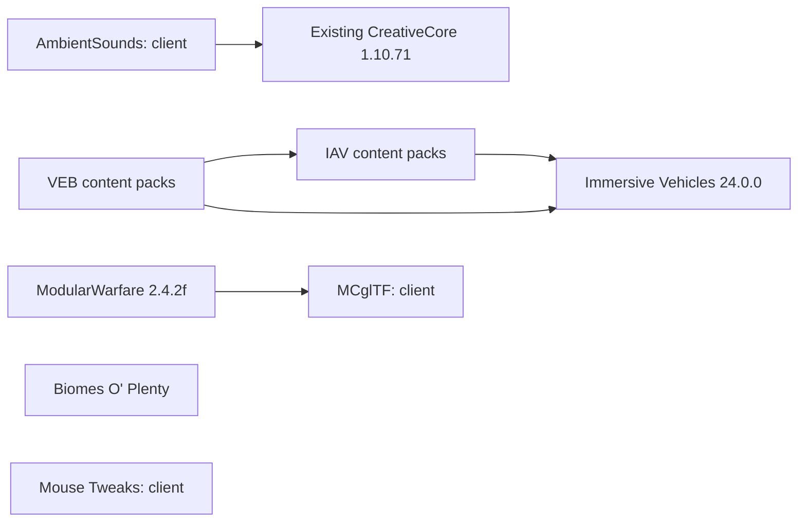

# RV compatibility and official downloads

RV uses Minecraft 1.12.2, Forge 14.23.5.2860 and Java 8. The additional files below are pinned by their official project/file IDs, byte sizes and SHA-256 digests in `vendor-catalog.json`.

| Component | Pinned file version | Official file | Installed on |
| --- | --- | --- | --- |
| AmbientSounds | 3.1.7 | [3516274](https://www.curseforge.com/minecraft/mc-mods/ambientsounds/files/3516274) | Client |
| Mouse Tweaks | 2.10.1 | [3359843](https://www.curseforge.com/minecraft/mc-mods/mouse-tweaks/files/3359843) | Client |
| Biomes O' Plenty | 7.0.1.2445 | [3558882](https://www.curseforge.com/minecraft/mc-mods/biomes-o-plenty/files/3558882) | Client and server |
| Immersive Vehicles | 24.0.0 | [7926592](https://www.curseforge.com/minecraft/mc-mods/minecraft-transport-simulator/files/7926592) | Client and server |
| IAV | 1.1.11 | [7088380](https://www.curseforge.com/minecraft/mc-mods/iav/files/7088380) | Client and server |
| VEB Automobilwerke Schwikau | 1.1.11 | [7088357](https://www.curseforge.com/minecraft/mc-mods/veb-aws/files/7088357) | Client and server |
| MCglTF | 2.0.3.0 | [4367036](https://www.curseforge.com/minecraft/mc-mods/mcgltf/files/4367036) | Client |
| ModularWarfare | 2.4.2f | [4426196](https://www.curseforge.com/minecraft/mc-mods/modularwarfare/files/4426196) | Client and server |

These additional files total 278,737,108 bytes for a client and 201,589,896 bytes for a server. A verified local cache avoids downloading them again. The existing RV 1.1.0 files and source bundles remain the baseline.

## Dependencies

AmbientSounds reuses the installed CreativeCore file. It does not require replacing CreativeCore with a newer Minecraft branch. MCglTF is a client dependency of this ModularWarfare build; it is excluded from the dedicated server package. Immersive Engineering is not required to load the selected vehicle packs. Some vendor crafting recipes reference it, so the curated garage must supply verified working vehicles and parts without advertising those recipes as available.

IAV and VEB are content archives discovered by Immersive Vehicles. They do not introduce separate Forge mod IDs. Their pack namespaces and definition hashes are recorded separately. ModularWarfare contains both `animated-2.4.2f-contentpack.zip` and `prototype-2.4.2f-contentpack.zip`; their original sizes and hashes are pinned together.

## Download and preservation rules

The Windows installer obtains these additional archives from their official hosts. GitHub release ZIPs contain the catalog and RV installation helpers, while these vendor binaries remain on their official download services. A current project license label does not approve redistribution of a different historical file or its bundled models.

Installation verifies the catalog digest first, then the exact sizes and SHA-256 digests of all required vendor files. It completes acquisition before changing an installation. An interrupted download can resume through the Windows PowerShell helper. A complete, verified cache works offline. A missing file requires its official source; a manual entry shows the exact file page.

Downloads use HTTPS and an explicit list of official hosts. Redirect destinations are checked before requests follow them. A response with the wrong size or digest cannot become an installed file. An existing unknown file with the same destination name is preserved and reported for review. Worlds, accounts, settings, connection data and unrelated mods remain outside vendor replacement.

RV checks GitHub quietly when its installer or launcher starts. Update-check failures do not prevent launching an already installed, verified game. Installing a missing required mod still requires verified bytes. The check does not open a browser automatically.

## Forge identity and worlds

File versions and versions reported by Forge are separate fields. For example, the AmbientSounds 3.1.7 binary declares Forge version `3.0`. Biomes O' Plenty's `mcmod.info` contains `7.0.1`, while the actual loaded build reports `7.0.1.2445`. Release protocol metadata uses versions observed in the native Forge runtime.

`requiredMods` contains shared client/server Forge IDs. `clientRequiredMods` also contains the client-only IDs used to detect renamed duplicate jars before launch. IAV and VEB are checked through their pinned archives and actual content definitions.

Biomes O' Plenty does not convert an existing world into a newly generated biome map. RV preserves the existing world's generator. Decorations use registered block names in the actual combined Forge runtime; numeric block registry IDs are never transferred between worlds. The `BIOMESOP` world type is an explicit choice for a new world.

## Release verification

A pinned catalog identifies exact artifacts and dependencies. It does not certify gameplay. Publication requires a matching native client/server run, duplicate-mod checks, verified content loading, installation/update preservation checks and a public-package audit. Vehicle interaction, ammunition, cross-mod damage, sound and controls require their own runtime evidence.

Screenshots must come from the corresponding native candidate. Claims about shaders, PBR, frame rate or every vehicle working require measurements from that build. Runtime logs, generated player data, private configuration and downloaded vendor binaries do not belong in the public source tree.
